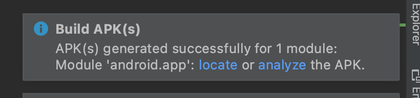
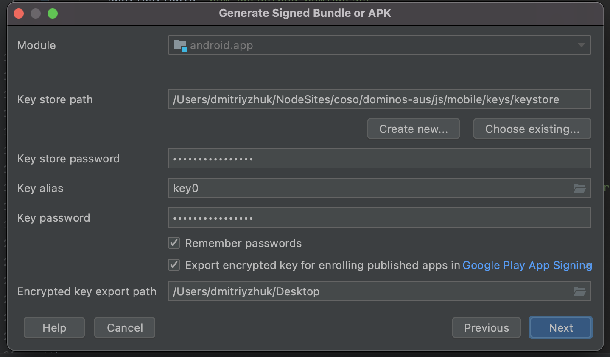

# Android

Domino's AUS App has three environments: DEV, UAT and PROD. The APK builds are uploaded to a folder in teams under [Dominos Australia > FIles > APK](https://connectsolutionscorp.sharepoint.com/:f:/r/sites/BravoTeam/Shared%20Documents/Dominos%20Australia/APK?csf=1&web=1&e=xDbPeO)

For deploying to the Play Market we build AAB (Android App Budble) which can not be installed directly on an android phone, but can be upload to production or testing in Google Console.

#### credentials

All credentials can be requested from [dmitriy.zhuk@cosocloud.com](mailto:dmitriy.zhuk@cosocloud.com)

## Setup requirments

- VScode
- Android Studio [https://developer.android.com/studio/install.html](https://developer.android.com/studio/install.html)
- Access to `dominos-australia/js/mobile` Git repo
- Android `keystore` with [credentials](#credentials)
- Anrdoid Google play console access for `developer@cosocloud.com` ([credentials](#credentials))

## Setup VScode

1. Clone `dominos-australia` repo
2. In your VScode open folder `../dominos-australia/js/mobile`
3. Install Cordova CLI `npm install -g cordova`
4. In terminal run command `npm i` to install all dependencies
5. In terminal run command `npm run build:debug:android` to build your first app and to initialize `Android Studio`

## Setup Android Studio

To test an app localy, you need to install an emulator for Android studio.

1.  Install required packages [https://capacitorjs.com/docs/getting-started/environment-setup#android-development](https://capacitorjs.com/docs/getting-started/environment-setup#android-development)
2.  Open `Menu > Tools > Device Manager`
3.  In the right Tab click on the button `Create device`
4.  In an opened window choose `Phone > Pixel 5 (or other modern device)` and click `Next`
5.  Choose release `R (Android 11.0)` as a recommended by Google
6.  Download Android and complete installation.

## Build

1. Open project in VScode `../dominos-australia/js/mobile`
2. In terminal run command: `npm run build:debug:android` for DEV

> for PROD run `npm run build:prod:android`
> for UAT run `npm run build:uat:android`

3. After VScode build is compilete Android studio will open.

> #### Notice:
>
> Pay attention if you see the following notification `Android Gradle Plugin can be upgraded`
>
> **DO NOT upgrade your Gradle version!**

4. In top bar `android > app` click on app and select `budle.gradle` file
5. Update `versionCode` and `versionName` accordingly

```gradle
defaultConfig {
  applicationId "com.cosocloud.dominosaus"
  minSdkVersion rootProject.ext.minSdkVersion
  targetSdkVersion rootProject.ext.targetSdkVersion
  versionCode 21 //-> 22
  versionName "1.0.56" //-> 1.0.57
  testInstrumentationRunner "androidx.test.runner.AndroidJUnitRunner"
}
```

6. In `Menu > Build > Build Bundle(s) / APK(s) > Build APK` to build DEV version

> For PROD or UAT version do `Menu > Build > Generate Signed Bundle or APK` and follow instructions below

7. After the app is build, a notification will show up in right corner

> ### Notification:
>
> APK(s) generated successfully for 1 module: Module 'android.app': locate or analyze the APK.



click on `locate` to open the folder with the APK build.

8. rename the AP build from `app-debug.apk` to `app-debug_v1.0.57.apk` for DEV

> for PROD or UAT rename from `app-release.apk` to `app-release_v1.0.57.apk`
> and `app-release.aab` to `app-release_v1.0.57.aab`

9. upload the apk to the `APK` folder in the `DominosAUS` teams group.

> The `AAB` file will be uploaded to the play maket.

> #### Notice:
>
> In case of an error try [Troubleshooting](#Troubleshooting)

## Signing the App (build for release)

> ### Important!
>
> Remeber to rebuild the app for PROD by runing `npm run build:prod:android`

1. In `Menu > Build > Generate Signed Bundle or APK`
2. In the opened window click the following `APK` and click next

> APK is used for smoke test becuase it can be installed direclty, but
> You will also need to build the `Android App Bundle` for play market.

3. In new window you need to configure the signing process (you will do this once)

> Key store path: `path to the key file` ([credentials](#credentials))
>
> Key store password: `PASSWORD` ([credentials](#credentials))
>
> Key alias: `key0`
>
> Key password: `PASSWORD` ([credentials](#credentials))



4. In next windows choose a release and finish building

> the build will be avaliable in folder `../dominos-aus/js/mobile/src-capacitor/android/app/release`

5. Please rename a build in following mask `app-release_vX.X.X.apk`

> do the same for AAB `app-release_vX.X.X.aab`

6. upload the apk to the `APK` folder in the `DominosAUS` teams group.
7. upload the `AAB` to playmarket

## Deploy (to play market)

1. Go to [Google Play Console](https://play.google.com/console)
2. Log in with `developer@cosocloud.com` ([credentials](#credentials))
3. Select `Domino's Pizza Enterprises Limited`
4. Select `Domino's Path to Excellence` with id `au.com.dominos.p2e.app`
5. In side menu select `Open testing`
6. Click `Create new release` / `Edit release` button on top right
7. Upload the `app-release_vX.X.X.aab` file and wait for the versions to fill automatically
8. In release note add which environment the app is pointing to

```
PROD env
or
UAT env
```

8. When finished click `Save`
9. Click `Review Release`
10. Click `Publish`

## Troubleshooting

Pay attention if you catch the following error:

```
Task :capacitor-cordova-android-plugins:compileDebugJavaWithJavac FAILED
public class FileProvider extends android.support.v4.content.FileProvider
```

in file `../mobile/src-capacitor/android/capacitor-cordova-android-plugins/src/main/java/io/github/pwlin/cordova/plugins/fileopener2/FileProvider.java`

replace the following rows:
`public class FileProvider extends android.support.v4.content.FileProvider`

to:
`public class FileProvider extends androidx.core.content.FileProvider`

read more in this [stackoverflow issue](https://stackoverflow.com/questions/48534293/android-support-v4-content-fileprovider-not-found)
