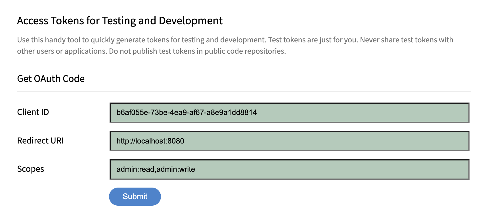
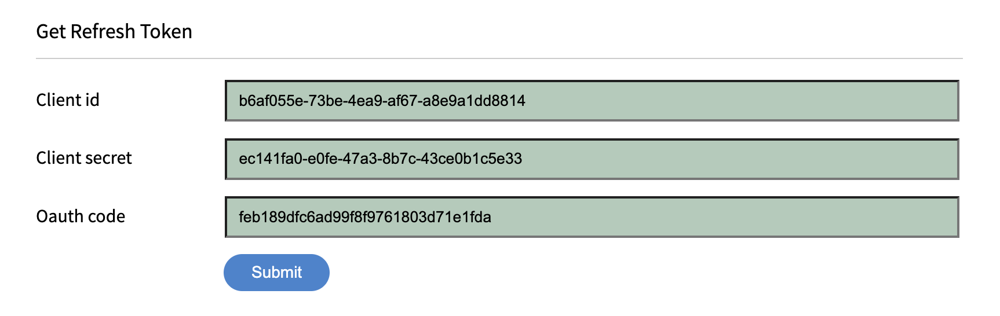
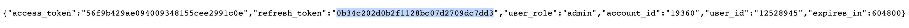

# Generate Refresh Token

> !Important
>
> RefreshToken, if regenerated, kills the previously generated one.

1. Go to `https://captivateprime.adobe.com/docs/primeapi/v2/tokenHelper.html`
2. Input prime Client Id and redirect URI `http://localhost:8080` and click `submit`

3. In a newly opened window copy `Code` from URL address bar and input into the next for `Oauth code` field

4. Input prime Client Secret and click `submit`
5. In the newly open window find the refreshToken in the json.

